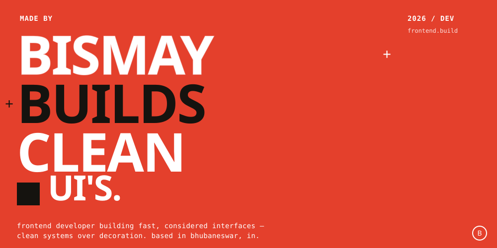

 

<table width="100%">
<tr>
<td width="55%" valign="top">

**ABOUT / NOW**
  
Building a GitHub developer-card generator and a personal technical blogging platform. Writing PRDs before code, always.

</td>
<td width="45%" valign="top">

**BASED**
  
Bhubaneswar, India — open to remote collaboration.

</td>
</tr>
</table>

 

**STACK**

`JavaScript` `TypeScript` `React` `Node.js` `Tailwind` `Git` `Figma`

 

**PROJECTS**

| NO. | PROJECT | DESCRIPTION | STACK |
|:---:|:---|:---|:---|
| 01 | **DEV CARD GENERATOR** | SVG / PNG developer banner builder for READMEs | TS · Canvas |
| 02 | **BLOG PLATFORM** | Dev.to-inspired personal publishing platform | React · Node |
| 03 | **PORTFOLIO OS** | This profile — a retro desktop-inspired README | HTML · SVG |

 

**STATS**

<table width="100%">
<tr align="center">
<td><h2>500+</h2>COMMITS</td>
<td><h2>16</h2>REPOS</td>
<td><h2>50+</h2>STARS</td>
<td><h2>04</h2>STREAK</td>
</tr>
</table>

 

**CONNECT**

`EMAIL` · `GITHUB` · `LINKEDIN`

 

© 2026 BISMAY — ALWAYS SHIPPING →

